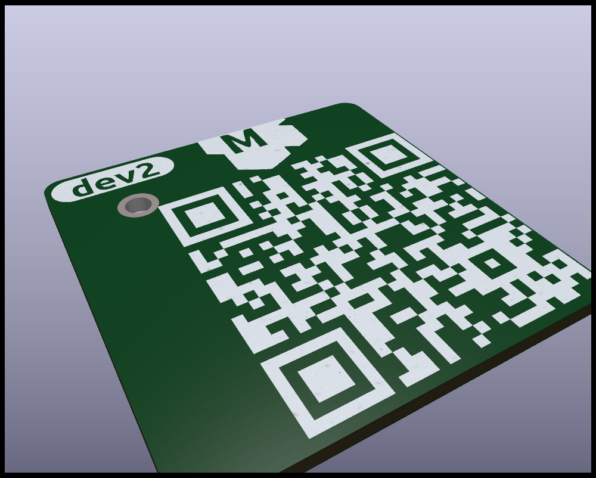

reproducing kibot `qr_lib` config problem


defining dir for output files created defined dir, 
but files are created in the project dir anyways, 
and footprint is always in the `project-qr.pretty` dir

```yaml
  - name: qr_lib
    type: qr_lib
    dir: '../project/lib/qr'
    options:
      qrs:
        - text: 'url-to-current-board-documentation'
```





Dev NOTE: before commit, run `./kibot.sh` to regenerate documentation, gerbers and other assets.

* [schematics.pdf](gen/schematics.pdf)
* [pcb.pdf with dimensions](gen/pcb.pdf)


